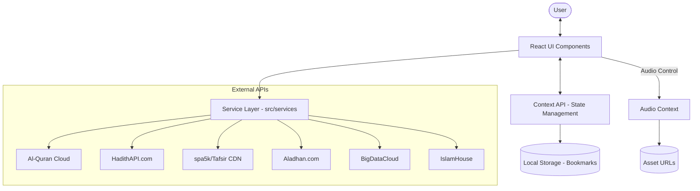

# 📖 Al-Furqan

**Al-Furqan** is a premium, comprehensive Islamic portal providing an all-in-one experience for Quranic study, Hadith research, Prayer Times, and scholarly literature. Built with modern technology and a focus on premium visual excellence.

---

## ✨ Key Features

- **🕋 Al-Quran**: Read and listen to the Holy Quran with multiple translations, reciters, and Mushaf (Madani) views.
- **📚 Hadith Collections**: Search and explore authentic Hadith from major collections including Bukhari, Muslim, and more.
- **📝 Tafseer**: High-quality scholarship with explanations from Ibn Kathir, Al-Muyassar, and other renowned sources.
- **🕌 Prayer Times**: Dynamic, location-based prayer timings with automatic detection and manual search.
- **📖 Islamic Books**: A curated digital library from IslamHouse for downloading and reading quality Islamic literature.
- **🛡️ Hisnul Muslim**: Comprehensive collection of daily Azkar and Duas.
- **🔖 Personalizations**: Bookmark Ayahs, Hadiths, and Books for later study.

---

## 🛠️ Project Architecture

The application follows a modular architecture that separates UI, state, and data fetching:



### Core Stack
- **Frontend**: [React 19](https://react.dev/) using [Vite](https://vite.dev/) for lightning-fast development and building.
- **Styling**: [Tailwind CSS](https://tailwindcss.com/) for a responsive, modern glassmorphic UI.
- **Animations**: [Framer Motion](https://www.framer.com/motion/) for smooth transitions and micro-interactions.
- **Icons**: [Lucide React](https://lucide.dev/) and [React Icons](https://react-icons.github.io/react-icons/) for a sharp, consistent visual language.
- **Routing**: [React Router 7](https://reactrouter.com/) for seamless navigation.

### Repository Structure
```text
src/
├── components/   # Reusable UI elements (Buttons, Cards, Modals)
├── context/      # Global state management (Audio, Bookmarks)
├── pages/        # Main screen components (Home, Quran, Hadith, etc.)
├── services/     # Centralized API logic and data fetching
└── data/         # Local static data and fallback JSON files
```

---

## 🌐 API Integrations

The application centralizes diverse data sources to provide real-time information:

| Feature | Provider | Endpoint | Purpose |
|---------|----------|----------|---------|
| **Quran** | Al-Quran Cloud | `api.alquran.cloud` | Text, Translations, Reciter Lists |
| **Hadith** | HadithAPI | `hadithapi.com` | Comprehensive Hadith Collections |
| **Tafseer** | spa5k (CDN) | `jsdelivr.net/gh/spa5k/tafsir_api` | High-quality scholarship text |
| **Prayer Times** | Aladhan | `api.aladhan.com` | Precise location-based timings |
| **Books** | IslamHouse | `islamhouse.com` | E-Books and Scholarly Downloads |
| **Geocoding** | BigDataCloud | `api.bigdatacloud.net` | Human-readable city names |

---

## 🚀 Getting Started

### Prerequisites
- [Node.js](https://nodejs.org/) (v18 or higher)
- [npm](https://www.npmjs.com/) or [yarn](https://yarnpkg.com/)

### Installation
1. Clone the repository
2. Install dependencies:
   ```bash
   npm install
   ```

### Development
Start the local development server:
```bash
npm run dev
```

### Production Build
Generate optimized files for deployment:
```bash
npm run build
```

---

## 📝 Maintenance Guide

### Adding New Islamic Modules
1. **Service**: Create a new file in `src/services/` to handle data fetching from the external API.
2. **Page**: Create a new component in `src/pages/` to display the features.
3. **Route**: Add the new page to the `Routes` component in `src/App.tsx`.
4. **Header**: update `src/components/Header.tsx` to include the new section in navigation.

### Updating API Endpoints
If an external API changes, you only need to update the `BASE_URL` or relevant function in the corresponding file inside `src/services/`.

---

## 📄 License
This project is open-source and available under the MIT License.
