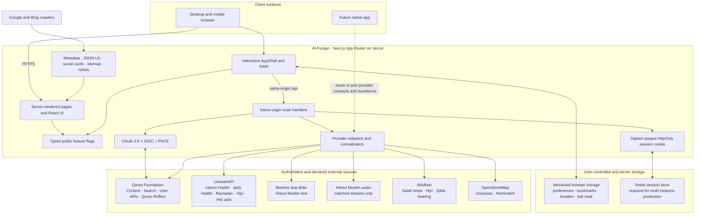

# Al-Furqan · الفرقان

Al-Furqan is a free, ad-free, privacy-respecting Quran and Sunnah companion. It combines authoritative Quran reading and study with sourced Hadith, Salah times, Dua, daily content, memorization aids, and nearby-masjid discovery in one calm web experience.

Religious content is never generated, reconstructed, paraphrased, graded, or silently substituted. Every production content path has an identified provider, and a provider failure produces an unavailable state rather than invented content.

Production: [al-furqan.app](https://al-furqan.app)

## What the app includes

### Quran reading and study

- All 114 Surahs with authoritative Arabic and dynamically discovered translations.
- Quran.Foundation Tajweed annotations rendered as a color-coded reading lens.
- Official QCF V2 Mushaf pages, line positions, glyphs, and per-page fonts—never approximated.
- Verse and chapter recitation, synchronized word highlighting, repeat ranges, and memorization controls.
- Word-by-word Arabic, transliteration, translation, Tafsir, translation footnotes, and Surah introductions.
- Navigation by Surah, Ayah, Juz, Hizb, Rub el Hizb, Ruku, Manzil, page, and custom Ayah range.
- Quran.Foundation Search with direct navigation back into reading context.
- Quran Reflect Lessons & Reflections linked to the Ayahs they discuss.
- Ayah-linked published Hadith and answers supplied by Quran.Foundation.
- Similar-Ayah references for Hifz review, clearly presented as a non-exhaustive aid.
- Local Quran bookmarks and last-read continuity without requiring an account.

### Sunnah, worship, and local tools

- Sunnah library with dynamically discovered major Hadith collections, Arabic and English text, provider search, pagination, references, available grades, and local bookmarks.
- Daily Quran verse and daily Hadith, selected deterministically once per UTC day.
- Full Salah Times page with explicit location setup, manual fallback, next-prayer countdown, calculation method, Asr school, Hijri date, and monthly calendar.
- Hisnul Muslim Dua browsing by category with Arabic, transliteration, translation, references, bookmarks, and source-matched audio where available.
- Masjid Finder using nearby OpenStreetMap places with distance, available address information, and external map directions.
- Ramadan timetable and locally adjustable calculated Hijri display date.
- Qibla bearing and compass implementation retained behind a public feature flag; it is disabled by default until mobile-browser orientation behavior is validated across supported devices.

### Product foundations

- No ads, tracking scripts, premium tier, or forced login for the public experience.
- Light, dark, and sepia themes; responsive desktop/mobile navigation; keyboard and reduced-motion considerations.
- Server-rendered Quran and Sunnah content, route metadata, canonical URLs, structured data, social cards, favicon/app icons, robots.txt, and a dynamic sitemap.
- Google Search Console domain verification and sitemap submission completed by the owner.
- Typed public feature flags for Salah Times, Dua, Qibla, and Masjid Finder.
- Provider adapters and data transformations separated from UI components where practical for a future native client.

## End-to-end architecture


```mermaid
flowchart TB
  subgraph Clients["Client surfaces"]
    Browser["Desktop and mobile browser"]
    Future["Future native app"]
  end

  subgraph NextApp["Al-Furqan · Next.js App Router on Vercel"]
    UI["Server-rendered pages and React UI"]
    Shell["Interactive AppShell and SWR"]
    Flags["Typed public feature flags"]
    Routes["Same-origin route handlers"]
    Adapters["Provider adapters and normalization"]
    OAuth["OAuth 2.0 + OIDC + PKCE"]
    Session["Signed opaque HttpOnly session cookie"]
    SEO["Metadata · JSON-LD · social cards · sitemap · robots"]
  end

  subgraph Storage["User-controlled and server storage"]
    Local["Versioned browser storage<br/>preferences · bookmarks · location · last read"]
    Redis["Redis session store<br/>required for multi-instance production"]
  end

  subgraph Providers["Authoritative and declared external sources"]
    QF["Quran.Foundation<br/>Content · Search · User APIs · Quran Reflect"]
    Ummah["UmmahAPI<br/>interim Hadith · daily Hadith · Ramadan · Hijri · Hifz aids"]
    DuaAPI["fitrahive dua-dhikr<br/>Hisnul Muslim text"]
    DuaAudio["Hisnul Muslim audio<br/>matched streams only"]
    AlAdhan["AlAdhan<br/>Salah times · Hijri · Qibla bearing"]
    OSM["OpenStreetMap<br/>Overpass · Nominatim"]
  end

  SearchEngines["Google and Bing crawlers"]

  Browser -->|"HTTPS"| UI
  Browser --> Shell
  Shell -->|"same-origin /api"| Routes
  Shell <--> Local
  UI --> Flags
  Shell --> Flags
  Routes --> Adapters
  Routes --> OAuth
  OAuth <--> QF
  Session <--> Redis
  Routes --> Session
  Adapters --> QF
  Adapters --> Ummah
  Adapters --> DuaAPI
  Adapters --> DuaAudio
  Adapters --> AlAdhan
  Adapters --> OSM
  SearchEngines --> SEO
  SEO --> UI
  Future -.->|"reuse or port provider contracts and transforms"| Adapters
```

The browser never receives Quran.Foundation client secrets, refresh tokens, raw sessions, or server-only provider keys. Public UI calls only Al-Furqan same-origin routes. See [the detailed architecture document](docs/ARCHITECTURE.md) for request flows, trust boundaries, caching, and deployment responsibilities.

## Technology

- Next.js 14 App Router, React 18, TypeScript, and npm.
- `@quranjs/api/server` for server-only Quran.Foundation Content, Search, OAuth, and User API integration.
- `@quranjs/api/public` only where browser-safe OAuth initiation is required.
- SWR for client-side loading and revalidation through same-origin routes.
- Redis for shared production OAuth sessions; in-memory storage is local-development only.
- Vitest plus configuration and live-route smoke checks.
- Vercel deployment with server-rendered routes, route handlers, generated metadata, and edge-aware caching.

## Data sources and integrity

| Capability | Source | Current status |
| --- | --- | --- |
| Quran, translations, Tafsir, word data, audio, Mushaf, structure, Search, Reflect, and User APIs | Quran.Foundation | Active; approved production Search and user scopes are configured by the owner |
| Sunnah library and daily Hadith | UmmahAPI over its declared Hadith dataset | Active interim source while Sunnah.com access remains pending |
| Salah times and calculated Qibla bearing | AlAdhan | Salah active; Qibla UI disabled by default |
| Dua and Dhikr text | fitrahive/dua-dhikr | Active with limited current English catalog |
| Matched Dua recordings | Hisnul Muslim audio | Interim streamed audio; omitted when matching is ambiguous |
| Nearby masjids and manual geocoding | OpenStreetMap Overpass and Nominatim | Active; completeness varies by community coverage |
| Ramadan, adjustable Hijri conversion, Qibla distance, and similar-Ayah relationships | UmmahAPI and its declared upstreams | Active where exposed in the UI |
| 99 Names of Allah | No approved source | Blocked until scholarly and translation provenance is available |

The complete license, attribution, caching, and provenance registry is in [docs/DATA-SOURCES.md](docs/DATA-SOURCES.md). Quran.Foundation content is never cached beyond its permitted limit and is not packaged as a permanent offline corpus.

## Security and privacy model

- OAuth uses Authorization Code with PKCE, server callback exchange, refresh handling, OIDC logout, session rotation, and signed `HttpOnly`, `SameSite=Lax` cookies.
- Production uses `REDIS_URL` so sessions survive across serverless instances; browser cookies contain only an opaque signed session identifier.
- Secrets and access/refresh tokens remain server-side. Never prefix them with `NEXT_PUBLIC_`.
- Public Quran access never requires login. Local preferences, bookmarks, location, theme, and last-read state stay in browser storage.
- Personalized Quran.Foundation User API responses are private and uncached.
- Third-party religious-source failure is fail-closed: no LLM or alternate provider silently fills missing scripture or scholarship.

## Local setup

Use a supported Node LTS release and npm.

```bash
npm install
cp .env.example .env.local
npm run dev
```

Required values:

```env
APP_BASE_URL=http://localhost:3000
CLIENT_ID=
CLIENT_SECRET=
SESSION_SECRET=
SCOPES=openid offline_access bookmark note collection goal preference
```

Generate a high-entropy `SESSION_SECRET`. Never commit `.env.local`. The production OAuth callback is `https://al-furqan.app/callback`; configured callback URLs and scopes must match the Quran.Foundation client.

Important optional values:

```env
REDIS_URL=
HADITH_ENABLED=true
UMMAH_API_KEY=
GOOGLE_SITE_VERIFICATION=
BING_SITE_VERIFICATION=

NEXT_PUBLIC_FEATURE_SALAH_TIMES=true
NEXT_PUBLIC_FEATURE_DUA=true
NEXT_PUBLIC_FEATURE_QIBLA=false
NEXT_PUBLIC_FEATURE_MASJID_FINDER=true
```

The four `NEXT_PUBLIC_FEATURE_*` values are public build settings, not secrets. Changing one in Vercel requires a redeployment. DNS-based Google ownership verification does not require `GOOGLE_SITE_VERIFICATION`.

## Verification commands

```bash
npm run lint
npm run typecheck
npm test
npm run build
npm run smoke:config
npm run smoke:routes
npm run sdk:status
```

## Current limitations and planned work

- Signed-in cross-device bookmark, note, collection, goal, and preference experiences require the remaining product UI and deployed end-to-end validation even though the scopes have been approved.
- Sunnah.com remains the preferred long-term Hadith source if official API access is granted; UmmahAPI is the declared interim provider and can be disabled with `HADITH_ENABLED=false`.
- Dua coverage currently follows the provider's limited English catalog and availability.
- Qibla remains off until real-device iOS Safari and Android Chrome orientation testing is complete; the numeric sourced bearing fallback remains part of the implementation.
- 99 Names of Allah remains blocked rather than shipping unattributed meanings.
- Arabic interface localization, a native iOS/Android client, stronger offline behavior subject to provider terms, and extended reading progress are future phases.
- Existing dependency audit findings require compatibility-aware remediation rather than automated breaking upgrades.

Project planning and audit documents live in [`docs/`](docs/), including the [Quran.Foundation capability matrix](docs/QURAN-FOUNDATION.md), [SEO EPIC](docs/EPIC-SEO.md), [feature-flag EPIC](docs/EPIC-FEATURE-FLAGS.md), and [offline strategy](docs/OFFLINE-STRATEGY.md).
