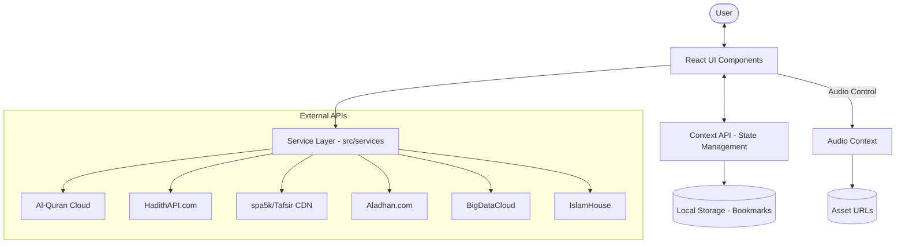

# 📖 Al-Furqan

**Al-Furqan** is a free, ad-free, privacy-first Quran and worship companion. Core reading works without an account; bookmarks, reading position, preferences, goals, and tasbih state are stored locally on the device.

## Product commitments

- No advertising, premium tier, account requirement, or behavioral tracking.
- Quran reading remains the primary experience; supporting tools avoid guilt and attention traps.
- Personal reading state is local-first and can be cleared through browser storage controls.
- Keyboard focus, reduced-motion preferences, readable contrast, and mobile-safe touch targets are core requirements.

---

## ✨ Key Features

- **🕋 Al-Quran**: Read and listen to the Holy Quran with multiple translations, reciters, and Mushaf (Madani) views.
- **📚 Hadith Collections**: Search and explore authentic Hadith from major collections including Bukhari, Muslim, and more.
- **📝 Tafseer**: High-quality scholarship with explanations from Ibn Kathir, Al-Muyassar, and other renowned sources.
- **🕌 Prayer Times**: Dynamic, location-based prayer timings with automatic detection and manual search.
- **📖 Islamic Books**: A curated digital library from IslamHouse for downloading and reading quality Islamic literature.
- **🛡️ Hisnul Muslim**: Comprehensive collection of daily Azkar and Duas.
- **🔖 Personalizations**: Bookmark Ayahs, Hadiths, and Books for later study.
- **🧭 Daily Companion**: Hijri date, private tasbih counter, and a gentle local reading goal.
- **📱 PWA**: Installable shell with offline caching for previously opened Quran content and translations.
- **🔎 Word by word**: On-demand Quran Foundation word meanings and transliteration with tap-to-explore cards and bounded offline caching.

---

## 🛠️ Project Architecture

The application follows a modular architecture that separates UI, state, and data fetching:


```mermaid
graph TD
    User([User]) <--> UI[React UI Components]
    UI <--> Context[Context API - State Management]
    UI --> Services[Service Layer - src/services]
    Context --> Cache[(Local Storage - Bookmarks)]
    
    subgraph "External APIs"
    Services --> QuranAPI[Al-Quran Cloud]
    Services --> HadithAPI[HadithAPI.com]
    Services --> TafseerAPI[spa5k/Tafsir CDN]
    Services --> PrayerAPI[Aladhan.com]
    Services --> GeocodeAPI[BigDataCloud]
    Services --> BooksAPI[IslamHouse]
    end
    
    UI -- "Audio Control" --> AudioContext[Audio Context]
    AudioContext --> Storage[(Asset URLs)]
```

### Core Stack
- **Frontend**: [React 19](https://react.dev/) using [Vite](https://vite.dev/) for lightning-fast development and building.
- **Styling**: [Tailwind CSS](https://tailwindcss.com/) for a responsive, modern glassmorphic UI.
- **Animations**: [Framer Motion](https://www.framer.com/motion/) for smooth transitions and micro-interactions.
- **Icons**: [Lucide React](https://lucide.dev/) and [React Icons](https://react-icons.github.io/react-icons/) for a sharp, consistent visual language.
- **Routing**: [React Router 7](https://reactrouter.com/) for seamless navigation.

### Repository Structure
```text
src/
├── components/   # Reusable UI elements (Buttons, Cards, Modals)
├── context/      # Global state management (Audio, Bookmarks)
├── pages/        # Main screen components (Home, Quran, Hadith, etc.)
├── services/     # Centralized API logic and data fetching
└── data/         # Local static data and fallback JSON files
```

---

## 🌐 API Integrations

The application centralizes diverse data sources to provide real-time information:

| Feature | Provider | Endpoint | Purpose |
|---------|----------|----------|---------|
| **Quran** | Al-Quran Cloud | `api.alquran.cloud` | Text, Translations, Reciter Lists |
| **Word meanings** | Quran Foundation | Server-side Content API | Word translation and transliteration |
| **Hadith** | HadithAPI | `hadithapi.com` | Comprehensive Hadith Collections |
| **Tafseer** | spa5k (CDN) | `jsdelivr.net/gh/spa5k/tafsir_api` | High-quality scholarship text |
| **Prayer Times** | Aladhan | `api.aladhan.com` | Precise location-based timings |
| **Books** | IslamHouse | `islamhouse.com` | E-Books and Scholarly Downloads |
| **Geocoding** | BigDataCloud | `api.bigdatacloud.net` | Human-readable city names |

---

## 🚀 Getting Started

### Prerequisites
- [Node.js](https://nodejs.org/) (v18 or higher)
- [npm](https://www.npmjs.com/) or [yarn](https://yarnpkg.com/)

### Installation
1. Clone the repository
2. Install dependencies:
   ```bash
   npm install
   ```

### Development
Start the local development server:
```bash
npm run dev
```

Word-by-word content requires server-only Quran Foundation credentials. Copy `.env.example` to `.env.local`, set `QF_CLIENT_ID` and `QF_CLIENT_SECRET`, keep `QF_ENV=prelive` during development, and run a server-function-aware environment such as `vercel dev`. Never prefix these credentials with `VITE_`.

### Production Build
Generate optimized files for deployment:
```bash
npm run build
```

---

## 📝 Maintenance Guide

### Adding New Islamic Modules
1. **Service**: Create a new file in `src/services/` to handle data fetching from the external API.
2. **Page**: Create a new component in `src/pages/` to display the features.
3. **Route**: Add the new page to the `Routes` component in `src/App.tsx`.
4. **Header**: update `src/components/Header.tsx` to include the new section in navigation.

### Updating API Endpoints
If an external API changes, you only need to update the `BASE_URL` or relevant function in the corresponding file inside `src/services/`.

---

## 📄 License
This project is open-source and available under the MIT License.

## Content provenance and known gaps

The application fetches provider content incrementally rather than redistributing a complete bundled corpus. [Al Quran Cloud's current terms](https://alquran.cloud/terms-and-conditions) permit non-commercial Quran-text display and personal/educational recitation downloads with edition attribution; Al-Furqan retains provider identifiers and is free/non-commercial. Exact translation attribution must still be surfaced more prominently in the reader. Quran Foundation word translation and transliteration are now integrated through a server-only OAuth2 gateway, attributed in the reader, and cached for six days under its [developer terms](https://qf-api-docs.pages.dev/legal/developer-terms/). The documented Content API does not provide morphology roots, so the interface states that limitation. The Quranic Arabic Corpus morphology download is GPL-licensed and requires a contact-email download flow, so it has not been silently copied into this MIT repository. The bundled Hisnul Muslim JSON still needs a documented upstream version and license in the release inventory.

Web background audio and scheduled adhan remain constrained by browser/PWA lifecycle and notification policies, especially on iOS: Media Session playback works where supported, but a closed browser cannot guarantee scheduled adhan. Offline audio now uses IndexedDB with per-Surah removal, though a proactive quota estimate and full-Surah batch downloader remain follow-ups. Word-by-word meaning/transliteration is activation-ready but needs issued Quran Foundation credentials in each deployment; morphology roots remain unavailable from the documented Content API. Dua transliterations, verified source citations for every bundled entry, 99 Names audio, complete Arabic translation of every legacy page, and optional account sync also remain follow-up work. See `docs/PRODUCT_BACKLOG.md`; licensing and scholarly review are release gates, not items to bypass.
