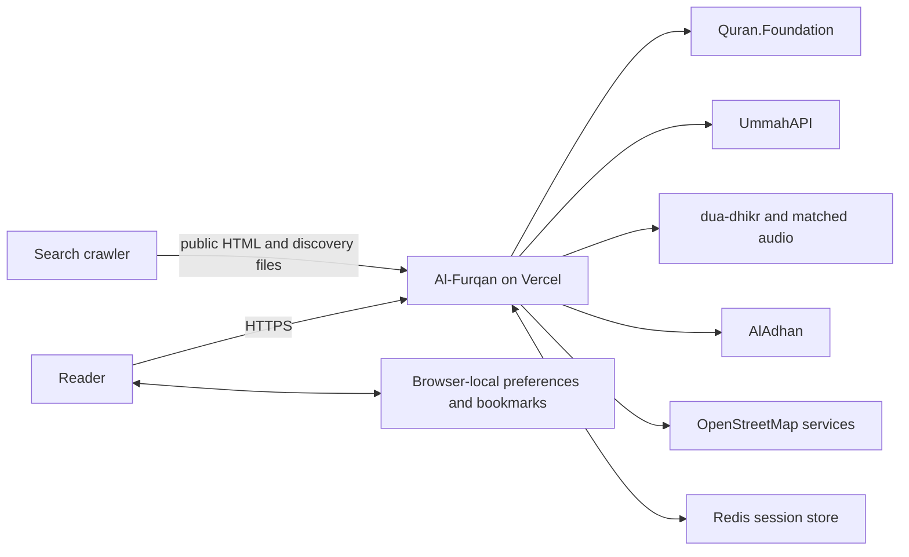
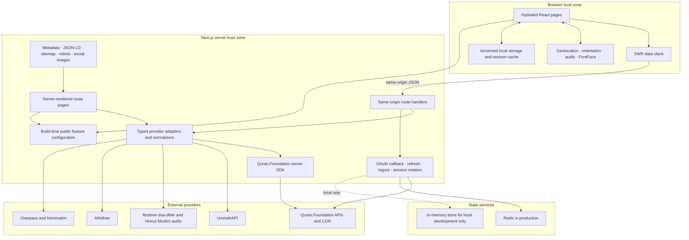
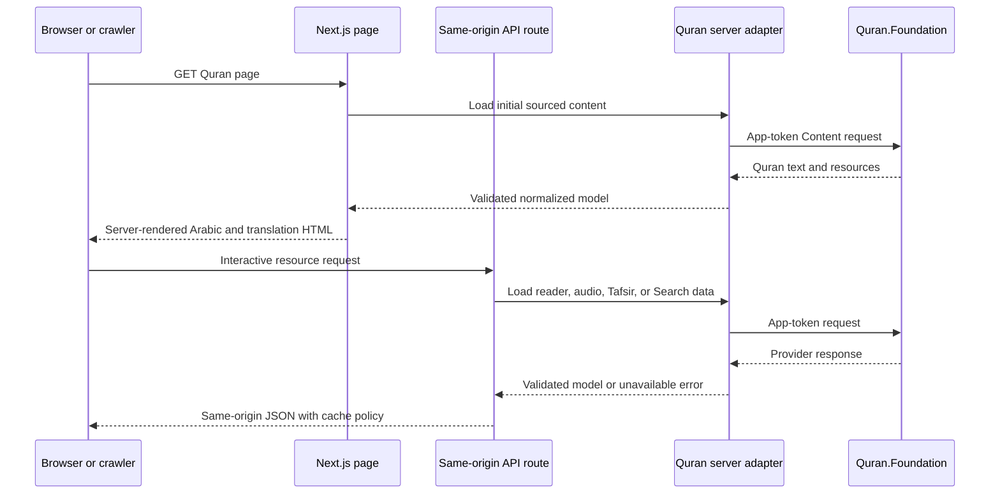
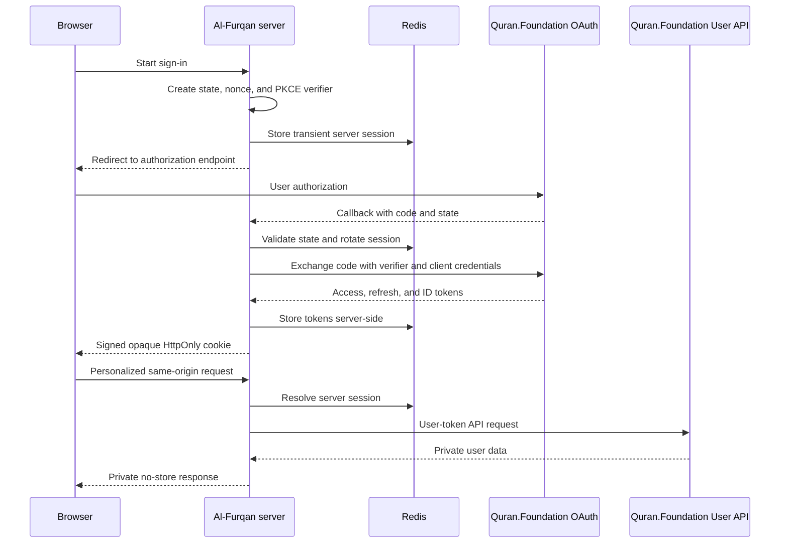

# Al-Furqan architecture

## System context

Al-Furqan is a Next.js App Router application deployed on Vercel. Public Quran and Sunnah pages are server rendered for accessibility, fast first content, and search crawlability; interactive controls hydrate in the browser. All confidential credentials, OAuth tokens, provider keys, and raw sessions remain behind same-origin route handlers.

## Container architecture

## Quran public-content request

Public Quran responses use short revalidation windows and remain below Quran.Foundation's one-week maximum caching rule. Quran text is rendered with `lang="ar"`, `dir="rtl"`, and `translate="no"`. Missing provider content is never reconstructed.

## OAuth and personalized User API flow

The browser never receives the client secret, refresh token, raw token set, or raw session. Production requires Redis because serverless instances cannot safely share an in-memory session store.

## Feature flags

Optional public sections use a single typed configuration in `src/lib/features.ts`. The same resolved values control navigation, homepage entry points, route availability, sitemap inclusion, metadata copy, and the generated social image.

| Feature | Default |
| --- | --- |
| Salah Times | Enabled |
| Dua | Enabled |
| Qibla | Disabled |
| Masjid Finder | Enabled |

A disabled feature returns the standard 404 page rather than exposing a dead or partially working experience. Flags are build-time `NEXT_PUBLIC_*` values and require redeployment after changes.

## Data ownership and caching

| Data | Location | Policy |
| --- | --- | --- |
| Quran public content | Provider plus short Next.js/edge cache | Never retained beyond Quran.Foundation terms; no permanent offline corpus |
| User API data and tokens | Redis-backed server session | Private, server-only, no shared caching |
| Theme, text size, last read, local bookmarks | Browser storage | User-device only; no login required |
| Location and Salah preferences | Browser storage | Sent only to same-origin calculation routes when needed |
| Mosque results | Server cache plus browser session cache | Short-lived and respectful of Overpass fair-use limits |
| Hadith and Dua responses | Provider-specific Next.js revalidation | No invented replacements; fail closed |

## Search and sharing architecture

- Public Quran and Sunnah pages include meaningful initial server HTML.
- Canonicals and route-specific metadata prevent duplicate-route ambiguity.
- WebSite, Organization, SoftwareApplication, and Breadcrumb structured data describe the application and content hierarchy.
- `/sitemap.xml` includes core enabled pages, discovered Surahs, and stable Hadith collection routes.
- `/robots.txt` advertises the sitemap and excludes API, callback, and private settings routes.
- Generated Open Graph/Twitter images and application icons support social previews.
- Disabled feature names and routes are removed from discovery surfaces.

## Future native boundary

Provider contracts, normalization, integrity validation, audio sequencing, daily selection, and local bookmark models are kept outside page components where practical. A future native client can reuse or port those rules, while replacing web-specific adapters for Next.js route handlers, browser geolocation/orientation, `localStorage`, `sessionStorage`, `FontFace`, and web audio. No native framework has been selected and no native scaffold exists yet.
