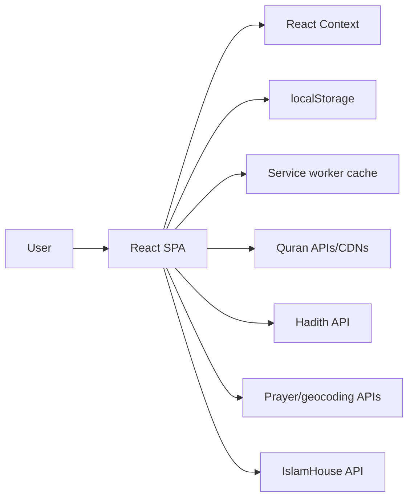
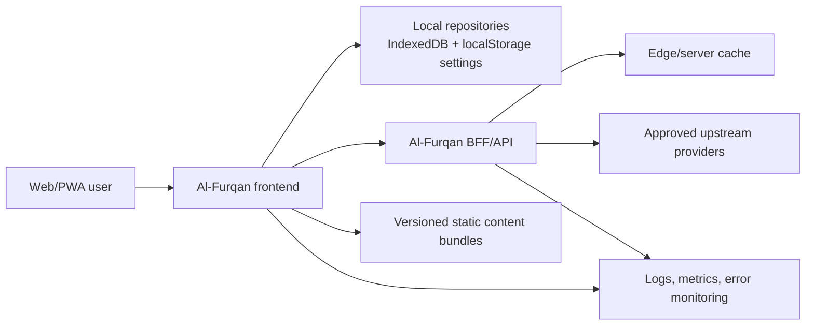

# Al-Furqan Architecture

## Current architecture

Al-Furqan is a static React SPA. The browser renders routes, calls external content APIs directly, stores preferences and favorites in local storage, and streams media from third-party CDNs.



This architecture is inexpensive and simple, but it exposes credentials, couples UI to provider payloads, makes reliability dependent on multiple third parties, and limits SEO and observability.

## Target architecture

Adopt a modular frontend with a small backend-for-frontend (BFF) boundary for credentials, normalization, caching, and observability. Keep public static datasets client-deliverable when licensing and integrity permit.



## Architectural principles

- Domain models do not depend on provider response shapes.
- Religious content includes source, edition, license, and version metadata.
- Features depend on repository interfaces, not raw `fetch`.
- Local-first reads are preferred for core Quran metadata and user data.
- Secrets never ship to the browser.
- External data is validated at runtime.
- Every network operation has timeout, cancellation, retry, and cache semantics.
- Route features are independently loadable and testable.
- Optional account sync is additive; core use does not require an account.

## Recommended frontend modules

```text
src/
├── app/
│   ├── providers/
│   ├── router/
│   └── observability/
├── components/
│   ├── ui/
│   └── islamic/
├── features/
│   ├── quran/
│   ├── search/
│   ├── audio/
│   ├── bookmarks/
│   ├── tafsir/
│   ├── prayer/
│   ├── hisnul/
│   ├── hadith/
│   └── library/
├── domain/
│   ├── quran/
│   ├── content/
│   └── user/
├── infrastructure/
│   ├── api/
│   ├── persistence/
│   └── pwa/
└── pages/
```

Do not perform this move as a bulk refactor. New tickets should establish boundaries, and touched legacy code should migrate incrementally.

## Data-access pattern

```ts
interface QuranRepository {
  getSurahMetadata(): Promise<SurahMetadata[]>;
  getAyahs(input: AyahQuery): Promise<Result<Ayah[], QuranError>>;
  search(input: QuranSearchQuery): Promise<Result<QuranSearchPage, QuranError>>;
}
```

Provider adapters map and validate DTOs:

```text
Page/component
  -> feature hook/use case
  -> domain repository interface
  -> local or remote adapter
  -> validated provider response
```

Use explicit `Result`-style outcomes or typed errors for offline, timeout, unavailable edition, rate limit, invalid response, and not-found states.

## State ownership

| State | Recommended owner |
|---|---|
| Theme, language, reciter, translation | Versioned settings repository + lightweight context |
| Audio lifecycle | Audio store/provider isolated from route components |
| Server/provider data | Query cache with stable keys and persistence where appropriate |
| Bookmarks, notes, history | Local repository, preferably IndexedDB for structured growth |
| Dialog/tab/input state | Local component state or URL state |
| Search and reader location | URL where shareable; local last-read record for resume |
| Account/sync | Separate optional module introduced later |

## Backend-for-frontend responsibilities

- Hold upstream credentials
- Enforce allowlisted endpoints and parameters
- Normalize and validate provider responses
- Cache immutable or slow-changing content
- Apply rate limits and abuse protection
- Attach source/version metadata
- Emit privacy-safe metrics
- Hide provider churn from the frontend

The BFF must not become an undocumented religious-content transformation layer. Preserve original text and source identifiers; transformations should be deterministic and tested.

## Routing and rendering

Near term:

- Keep React Router and current URLs.
- Lazy-load route modules.
- Add canonical redirects for aliases.
- Add global and route error boundaries.
- Add route metadata configuration.

Medium term:

- Evaluate pre-rendering or SSR for public Quran, tafsir, Hadith, and book metadata pages.
- Keep authenticated/personal state client-side.
- Generate sitemap and structured data from canonical content indexes.

## PWA and offline architecture

Replace the hand-written broad cache strategy with explicit versioned policies:

- App shell: precache with atomic update behavior.
- Quran metadata and selected text editions: versioned, integrity-checked bundles.
- Audio and books: explicit user downloads with storage estimates and removal controls.
- API data: bounded runtime caches with expiration.
- User data: separate from content cache and never deleted during ordinary service-worker upgrades.

Display update availability and offline state. Never silently serve stale prayer times as current.

## Security architecture

- No secrets in `VITE_*` variables or client source.
- Apply CSP, HSTS, Referrer-Policy, Permissions-Policy, and clickjacking protection.
- Restrict `connect-src`, media, font, and image origins.
- Sanitize or render provider text as text; avoid raw HTML.
- Validate URL schemes for downloads/media.
- Minimize geolocation precision and transmission.
- Define analytics events without Quran query text, notes, exact location, or reading history.

## Observability

Track:

- Route and API error rates
- Provider latency and availability
- Audio playback failures
- Offline/cache update failures
- Web Vitals by device class
- Search result success without logging sensitive query text by default
- Content version and provider in error context

Do not log precise coordinates, bookmark contents, notes, or full search queries.

## Migration sequence

1. Tests and CI
2. Provider/security boundary
3. Domain contracts and adapters
4. UI primitives and error boundaries
5. Quran reader and bookmarks repositories
6. Search and audio
7. Word-by-word and unified tafsir
8. Remaining feature modules

Each step must preserve current routes and include a rollback path.
